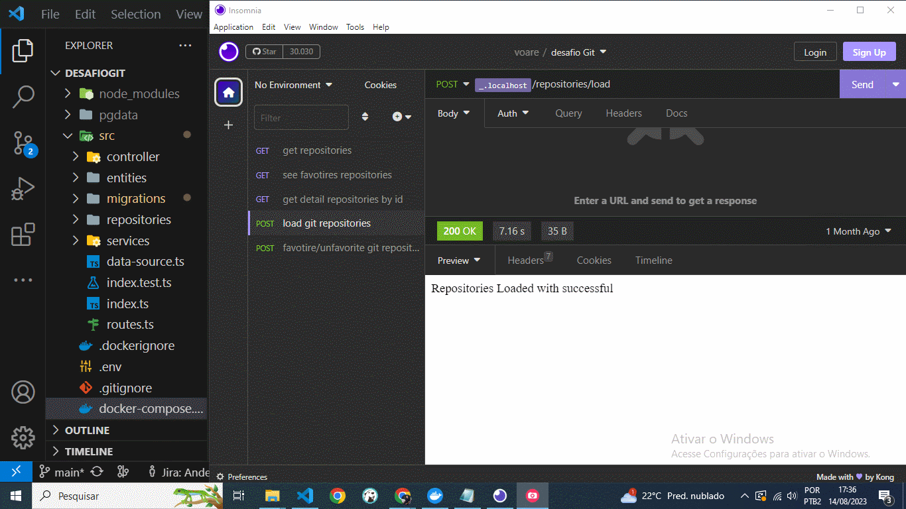

# 😸 Desafio GitHub

Projeto Desafio  
Criação de uma API que liste os 5 principais repositórios com mais estrelas no GitHub de 5 linguagens aleatórias. Além disso, a API permitirá listar perfis com detalhes, favoritar e desfavoritar perfis. O projeto também incluirá testes integrados com Jest. A API será desenvolvida com um banco de dados PostgreSQL utilizando Docker e Docker-Compose para simplificar o processo de implantação.

## Pré-requisitos

Visual Studio Code
1. Docker
2. Node version 16.13.1

## Uso
Clone o Projeto no GitHub:
https://github.com/1andersonmotta/desafioGit.git 
1. Rode o comando yarn install
2. Com Docker aberto rode o comando: docker-compose up 

## End Points

1. Primeiro Carregue os Repositórios do GitHub com método POST:  `http://localhost:3000/repositories/load`
2. Visualize todos os Perfis com método GET:  `http://localhost:3000/repositories`
3. Consulte os detalhes com o valor id no parâmetro com o método GET: `http://localhost:3000/repositories/details/:id`
4. Favorito/Desfavorito com valor id e método POST: `http://localhost:3000/repositories/favorite/:id`
5. Veja seus Favoritos com o método GET: `http://localhost:3000/repositories/favorite`

[Insomnia](https://insomnia.rest/download)

## 🛠 Ferramentas

- [JavaScript](https://developer.mozilla.org/pt-BR/docs/Web/JavaScript)
- [Docker](https://www.docker.com/)
- [Jest](https://jestjs.io/pt-BR/)

## Contribuição

Se você tem alguma Sugestão enviar para devandersonmotta@gmail.com com o assunto: "contribuição desafioGit" ou entre em contato pelo Linkedin.

## Licença

MIT

## ✉ Contato

email: devandersonmotta@gmail.com

linkedin: www.linkedin.com/in/anderson-motta-96b138235
---

## 💡 Objetivo

Praticar e adquirir conhecimento. 

